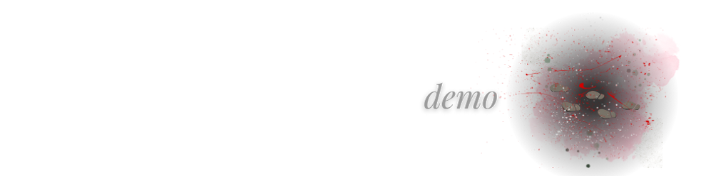

<p align="center">

</p>

[](https://opensource.org/licenses/MIT) 
[](https://nodejs.org/en)
[](https://www.mongodb.com/)
[](https://expressjs.com/)
[](https://www.npmjs.com/package/mongoose)
[](https://canva.com/)


### 

  - [OVERVIEW](#overview)
    - [*user story*](#user-story)
    - [*acceptance criteria*](#acceptance-criteria)
    - [*killer list*](#killer-list)
  - [INSTALLATION](#installation)
  - [USAGE](#usage)
    - [*screenshot*](#screenshot)
    - [*demo*](#demo)
  - [TESTING](#testing)
  - [SOURCES](#sources)
  - [LICENSE](#license)
  - [LINKS](#links)
  - [CONNECT](#connect)

### 

`SERIAL SOCIAL` is an API for a social network web application where true crime fanatics can share their thoughts, react to freiends' thoughts, and create a killer friend list. The app uses [Express.js](https://www.npmjs.com/package/express) for **routing**, a [MongoDB](https://www.mongodb.com/) **database**, [Mongoose](https://www.npmjs.com/package/mongoose) as the **ORM**, and the [Moment.js](https://momentjs.com/) npm package for **timestamp formatting**.

### 
<!-- <p align="center">
  
</p> -->

### 
<!-- <p align="center">
  
</p> -->

### 
<!-- <p align="center">
  
</p> -->
#

### 

The application is invoked using the following commands:

##### *Clone the repository in your local development enviornment*

```
git clone https://github.com/christiecamp/serial-social.git
```
##### **Create a *.env* to secure your information**

##### **Ensure that you have installed [MongoDB](https://www.mongodb.com/) & [MongoDB Compass](https://www.mongodb.com/products/tools/compass) onto your computer, and that the connection is live**

##### *Navigate to the CLI and input:*

```javascript
npm i express dotenv mongoose moment
```


#

### 

**INSTRUCTIONS:**

1. Open the Integrated Terminal and follow the [installation](#installation) guidelines

2. Interact with `SERIAL SOCIAL's` back end with [Insomnia](https://www.npmjs.com/package/inquirer/v/8.2.4) or **MongoDB Compass** by testing the below:
      * GET all users & thoughts
      * GET user, thought, friend, & reaction by id
      * CREATE user, thought, & reaction
      * UPDATE user, thought, friend, & reaction
      * DELETE user & thought

      ##### view [demo videos](#demo) and [testing](#testing) for further help


### 
             
##### *screenshot demonstrates `SERIAL SOCIAL's` back end, testing all routes with **Insomnia***

<!-- <p align="center">

</p> -->


### 

##### **users**

<!-- <p align="left">

</p> -->

##### **thoughts**

<!-- <p align="left">

</p> -->

#
    🚧  under construction - come back soon!🚜
